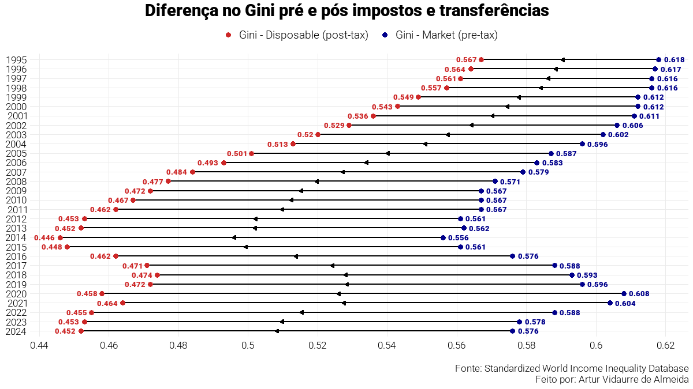

# Impacto de impostos e transferências na desigualdade brasileira

Este repositório contém análises sobre a desigualdade brasileira de 1995 até 2025 e em perspectiva internacional sob uma ótica da diferença do Gini pre-tax e post-tax, usando dados do IPEADATA e do SWIID.

## 📁 Estrutura do Projeto

- `dados`: Dados brutos baixados
- `scripts`: Importação, tratamento e criação da visualização das análises.
- `outputs`: Gráficos finais em PNG.

## 🛠️ Tecnologias Utilizadas

- **Linguagem**: R
- **Tratamento**: dplyr
- **Visualização**: ggplot2, sysfonts, showtext, ggtext

## 📊 Fonte dos Dados

Os dados foram importados diretamente do IPEADATA (série longa do Gini brasileiro) e do Standardized World Income Inequality Database1 (SWIID)

## 👤 Autor

Artur Vidaurre de Almeida

